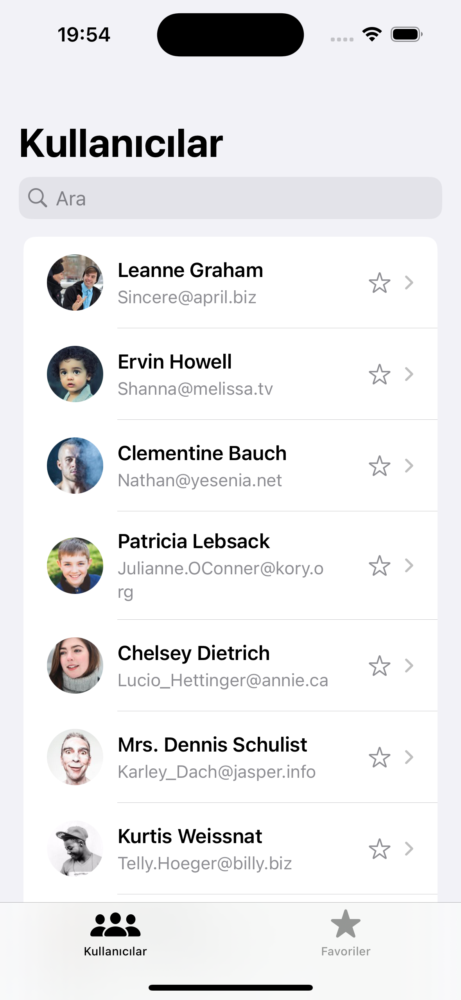
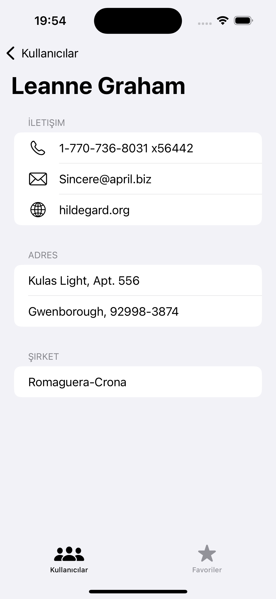
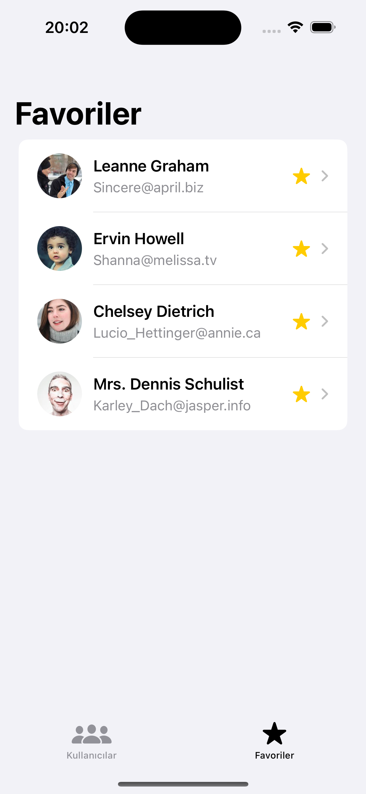
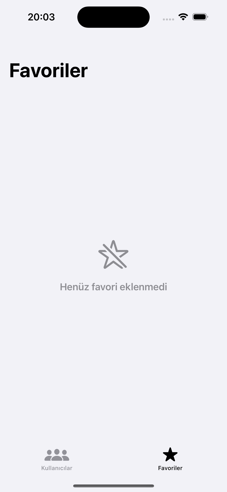

# 👤 UserFavoritesApp

SwiftUI ile geliştirilen bu örnek uygulama, kullanıcı listesini bir public API üzerinden çekerek arama, detay görüntüleme ve favorilere ekleme/çıkarma özelliklerini barındırır. Proje, modern iOS uygulama geliştirme prensiplerini baz alarak MVVM mimarisiyle oluşturulmuştur. Dark mode desteği sunulmaktadır.


---

## 🧱 Mimari

- **MVVM (Model - View - ViewModel):** SwiftUI ile uyumlu, sürdürülebilir mimari yapı.
- **Generic Network Layer:** Reusable API çağrı yapısı (`NetworkManager`, `Endpoint`).
- **Modüler Yapı:** `View`, `ViewModel`, `Model`, `Service` olarak ayrılmış temiz dosya yapısı.
- **Reusable Components:** `UserRowView` gibi bileşenler farklı ekranlarda tekrar kullanılır.

---

## 📲 Özellikler

- ✅ Kullanıcı listesini API'den çeker (`https://jsonplaceholder.typicode.com/users`)
- ✅ Arama çubuğu ile kullanıcıları filtreler
- ✅ Kullanıcı detayları (adres, telefon, şirket bilgileri) ayrı ekranda görüntülenir
- ✅ Kullanıcılar favorilere eklenebilir/çıkarılabilir
- ✅ Favoriler local olarak `UserDefaults` ile saklanır
- ✅ `TabView` içinde 2 ayrı sekme: Kullanıcılar / Favoriler
- ✅ Favoriler ekranı boşsa kullanıcıya görsel destekli mesaj gösterilir

---

## 🧩 Teknik Detaylar

### 🔄 Ağ Katmanı
```swift
NetworkManager.shared.request(endpoint: .users, completion: ...)
```
- `Endpoint` enum'u ile tüm API uç noktaları yönetilir.
- `NetworkManager` generic olarak `Decodable` modellere map eder.

### 💾 Favori Yönetimi
```swift
@Published var favorites: Set<Int>
UserDefaults.standard.set(Array(favorites), forKey: "favorites")
```

---

## 🧪 Geliştirici Notları

- Uygulama SwiftUI Preview desteğiyle tasarlandı.
- `@EnvironmentObject` ile ViewModel uygulama genelinde paylaşıldı.
- `AsyncImage` kullanılarak avatarlar API'den dinamik olarak yüklendi.
- Navigation, Search, List ve Empty State gibi iOS standart UX desenleri kullanıldı.

---

## 📸 Ekran Görüntüleri

<h3 align="left"> 1. Kullanıcılar Ekranı </h3>
<p align="left">
  
</p>

<h3 align="left"> 2. Detay Görünümü </h3>
<p align="left">
  
</p>

<h3 align="left"> 3. Favoriler Listesi </h3>
<p align="left">
  
</p>

<h3 align="left"> 4. Boş Favoriler Ekranı </h3>
<p align="left">
  
</p>

---

## 🚀 Gereksinimler

- Xcode 14+
- iOS 15+
- Swift 5.7+

---